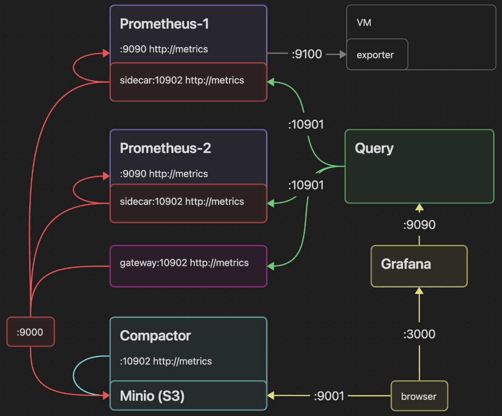

# Monitoring Stack

Мониторинг инфраструктуры на базе Prometheus, Thanos и Grafana.



## Подготовка системы

Все сервисы работают от пользователя `srv`:

```bash
# Создать пользователя и группу
sudo groupadd -r srv
sudo useradd -r -g srv -s /bin/false srv

# Создать директории
sudo mkdir -p /path/from/service/

# Установить владельца
sudo chown -R srv:srv /path/from/service/
```

## Компоненты

### Основные сервисы
- [Prometheus](prometheus/README.md) — сбор и хранение метрик
- [Thanos](thanos/README.md) — агрегация и долгосрочное хранение
- [Grafana](grafana/README.md) — визуализация и дашборды

### Exporters
- [Node Exporter](exporters/node_exporter/README.md) — системные метрики Linux
- [Process Exporter](exporters/process_exporter/README.md) — мониторинг процессов
- [MySQL Exporter](exporters/mysqld_exporter/README.md) — метрики MySQL/MariaDB
- [Windows Exporter](exporters/windows_exporter/README.md) — системные метрики Windows
- [CUBA JVM](exporters/cuba_jvm/README.md) — JMX метрики Java приложений
- [Blackbox Exporter](exporters/blackbox_exporter/README.md) — мониторинг web ресурсов